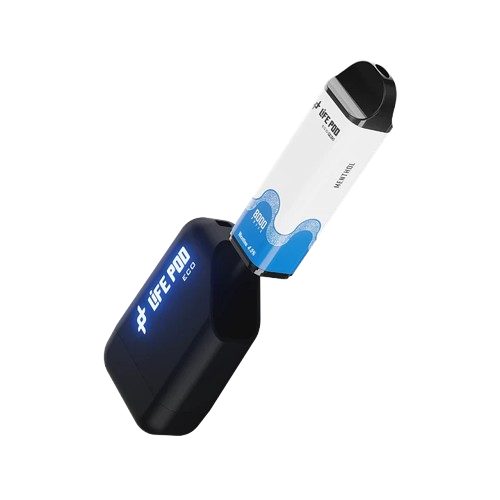
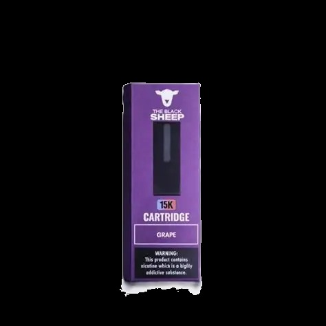

# 🎨 GUÍA DE PERSONALIZACIÓN - Megatrade Vapes

## 📝 Cambiar nombres y descripciones de los vapes

Abre el archivo `index.html` y busca cada sección de vape. Cada vape tiene esta estructura:

```html
<div class="vape-card">
    <div class="vape-image">
        
    </div>
    <div class="vape-info">
        <h3>NOMBRE DEL VAPE AQUÍ</h3>
        <p class="vape-description">DESCRIPCIÓN AQUÍ</p>
        <ul class="vape-features">
            <li><i class="fas fa-battery-full"></i> CARACTERÍSTICA 1</li>
            <li><i class="fas fa-tint"></i> CARACTERÍSTICA 2</li>
            <li><i class="fas fa-wind"></i> CARACTERÍSTICA 3</li>
        </ul>
        <button class="btn btn-whatsapp order-btn" data-model="NOMBRE PARA WHATSAPP">
            <i class="fab fa-whatsapp"></i> Pedir por WhatsApp
        </button>
    </div>
</div>
```

### Qué puedes cambiar:

1. **`<h3>NOMBRE DEL VAPE AQUÍ</h3>`** - El nombre que aparece en la tarjeta
2. **`<p class="vape-description">DESCRIPCIÓN AQUÍ</p>`** - La descripción corta
3. **Las características `<li>`** - Cambia el texto después del icono
4. **`data-model="NOMBRE PARA WHATSAPP"`** - El nombre que aparecerá en el mensaje de WhatsApp

### Ejemplo de personalización:

```html
<div class="vape-card">
    <div class="vape-image">
        
    </div>
    <div class="vape-info">
        <h3>Vape Tropical Mango</h3>
        <p class="vape-description">Sabor exótico de mango con un toque fresco de menta.</p>
        <ul class="vape-features">
            <li><i class="fas fa-battery-full"></i> 2500 puffs</li>
            <li><i class="fas fa-tint"></i> 7ml de e-liquid</li>
            <li><i class="fas fa-wind"></i> Sabor mango-menta</li>
        </ul>
        <button class="btn btn-whatsapp order-btn" data-model="Vape Tropical Mango">
            <i class="fab fa-whatsapp"></i> Pedir por WhatsApp
        </button>
    </div>
</div>
```

---

## 🎨 Cambiar los colores

Abre `styles.css` y al principio verás las variables de color:

```css
:root {
    --primary-color: #4a90e2;      /* Azul principal */
    --secondary-color: #50c878;    /* Verde secundario */
    --accent-color: #ff6b6b;       /* Rojo de acento */
    --dark-color: #2c3e50;         /* Gris oscuro para texto */
    --light-color: #ecf0f1;        /* Gris claro para fondo */
    --white: #ffffff;             /* Blanco */
    --whatsapp-color: #25d366;    /* Verde WhatsApp */
}
```

### Ejemplos de combinaciones de colores:

**Tema Morado/Rosa:**
```css
:root {
    --primary-color: #9b59b6;      /* Morado */
    --secondary-color: #ff69b4;    /* Rosa */
    --accent-color: #ff6b6b;       /* Rojo coral */
}
```

**Tema Naranja/Amarillo:**
```css
:root {
    --primary-color: #f39c12;      /* Naranja */
    --secondary-color: #f1c40f;    /* Amarillo */
    --accent-color: #e74c3c;       /* Rojo */
}
```

**Tema Negro/Blanco (elegante):**
```css
:root {
    --primary-color: #2c3e50;      /* Gris oscuro */
    --secondary-color: #34495e;    /* Gris medio */
    --accent-color: #e74c3c;       /* Rojo intenso */
}
```

---

## 📱 Cambiar el nombre de la marca

En `index.html`, busca esta sección (línea ~22):

```html
<div class="logo">
    <i class="fas fa-cloud"></i>
    <h1>Megatrade Vapes</h1>
</div>
```

Cambia "Megatrade Vapes" por el nombre de tu marca.

También en el footer (línea ~212):

```html
<div class="footer-logo">
    <i class="fas fa-cloud"></i>
    <h3>Megatrade Vapes</h3>
</div>
```

---

## 🔗 Cambiar los mensajes de WhatsApp

Abre `script.js` y busca estas funciones:

**Mensaje para pedidos específicos:**
```javascript
function handleOrderClick(modelName) {
    const message = `Hola, estoy interesado en el ${modelName}. ¿Me podrías dar más información?`;
    // ...
}
```

**Mensaje de contacto general:**
```javascript
function handleContactClick() {
    const message = 'Hola, vi tu catálogo de vapes y me gustaría obtener más información.';
    // ...
}
```

Puedes personalizar estos mensajes como quieras.

---

## 🖼️ Cambiar el icono de la marca

En `index.html`, busca `<i class="fas fa-cloud"></i>` y cambia `fa-cloud` por otro icono de Font Awesome:

Algunas opciones:
- `fa-fire` (fuego)
- `fa-bolt` (rayo)
- `fa-star` (estrella)
- `fa-crown` (corona)
- `fa-gem` (gema)
- `fa-heart` (corazón)

---

## 📝 Cambiar textos de la página principal

**Título principal (Hero):**
```html
<h2>Descubre los Mejores Vapes del Mercado</h2>
<p>Calidad premium, sabores únicos y tecnología de vanguardia</p>
```

**Título del catálogo:**
```html
<h2 class="section-title">Nuestros Modelos</h2>
<p class="section-subtitle">7 modelos exclusivos para elegir</p>
```

**Información de contacto:**
```html
<div class="contact-item">
    <i class="fab fa-whatsapp whatsapp-icon"></i>
    <div>
        <h3>WhatsApp</h3>
        <p>Respuesta inmediata</p>
    </div>
</div>
```

---

## 🚀 Agregar más vapes

Si quieres agregar más de 7 vapes, copia y pega esta estructura en `index.html`:

```html
<div class="vape-card">
    <div class="vape-image">
        
    </div>
    <div class="vape-info">
        <h3>Nombre del Vape 8</h3>
        <p class="vape-description">Descripción del vape 8</p>
        <ul class="vape-features">
            <li><i class="fas fa-battery-full"></i> Característica 1</li>
            <li><i class="fas fa-tint"></i> Característica 2</li>
            <li><i class="fas fa-wind"></i> Característica 3</li>
        </ul>
        <button class="btn btn-whatsapp order-btn" data-model="Nombre del Vape 8">
            <i class="fab fa-whatsapp"></i> Pedir por WhatsApp
        </button>
    </div>
</div>
```

No olvides agregar la imagen `vape8.jpg` a la carpeta.

---

## 🌐 Cambiar el idioma

Si quieres cambiar los textos a otro idioma, simplemente edita los textos en `index.html`. La estructura es la misma, solo cambia el contenido.

---

## 💡 Tips de diseño

1. **Mantén consistency** - Usa el mismo estilo en todas las tarjetas
2. **Sé conciso** - Las descripciones cortas funcionan mejor
3. **Usa imágenes de calidad** - Las fotos profesionales venden más
4. **Destaca lo único** - Menciona qué hace especial a cada vape
5. **Sé honesto** - Las características reales generan confianza

---

## ✨ Ejemplo completo de personalización

Si tienes una marca llamada "VapeX" con colores negro y dorado:

**En `styles.css`:**
```css
:root {
    --primary-color: #1a1a1a;      /* Negro */
    --secondary-color: #d4af37;    /* Dorado */
    --accent-color: #c0392b;       /* Rojo oscuro */
}
```

**En `index.html` (logo):**
```html
<div class="logo">
    <i class="fas fa-bolt"></i>
    <h1>VapeX</h1>
</div>
```

**En `index.html` (hero):**
```html
<h2>VapeX - La Revolución del Vapeo</h2>
<p>Tecnología de punta, sabores increíbles, estilo único</p>
```

---

¡Personaliza tu catálogo a tu gusto! 🎨